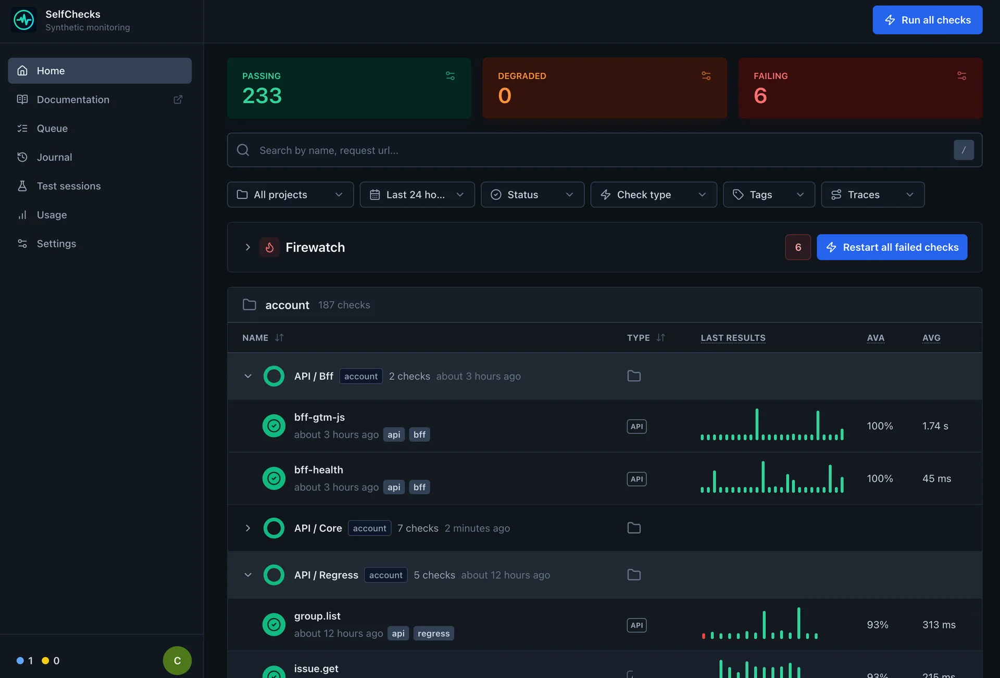
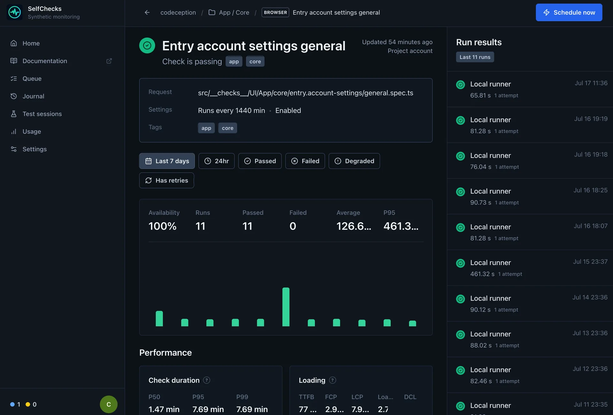

# Selfchecks

Selfchecks is a self-hosted synthetic monitoring service for browser and API checks.
Checks live with application code, run on your own worker, and keep logs, screenshots,
traces, videos, request/response data, and CI metadata in one dashboard.

Public documentation: [selfchecks.github.io](https://selfchecks.github.io/getting-started.html)

Questions and feedback: [Telegram](https://t.me/aleksnick)

## Product preview





## Install

The constructs and CLI packages are published under the `@selfchecks` npm
organization. The starter generator is available as `create-selfchecks` so it can be
run directly with `npx`:

```bash
npx create-selfchecks my-checks

# Or install the packages manually
npm install --save-dev @selfchecks/selfchecks @selfchecks/selfchecks-cli @playwright/test
```

- `create-selfchecks` creates a minimal project and installs its dependencies.
- `@selfchecks/selfchecks-cli` provides the `selfchecks` command for remote
  `deploy`, `test`, and `trigger` operations.
- `@selfchecks/selfchecks` provides the supported checks-as-code constructs.

The npm CLI is the recommended CI client. The container images are still used to run
the Selfchecks server and worker, but projects do not need a Selfchecks Docker image
just to upload or trigger checks.

## Quick start

Generate a ready-to-run project containing one browser check for
`https://selfchecks.github.io/`:

```bash
npx create-selfchecks my-checks
cd my-checks
npx playwright install chromium
npm test
```

Without a directory argument, `npx create-selfchecks` creates
`./selfchecks-project`. Pass `--skip-install` when only the files are needed.

Set the URL and API token issued by your Selfchecks server:

```bash
export SELFCHECKS_URL=https://checks.example.com
export SELFCHECKS_API_TOKEN=replace-with-a-ci-secret
```

Create a browser check:

```ts
// checks/homepage.check.ts
import { BrowserCheck, Frequency } from "@selfchecks/selfchecks/constructs";

new BrowserCheck("homepage", {
  name: "Homepage",
  activated: true,
  frequency: Frequency.EVERY_15M,
  tags: ["smoke", "browser"],
  code: {
    entrypoint: "homepage.spec.ts",
  },
});
```

The entrypoint is a normal Playwright Test file:

```ts
// checks/homepage.spec.ts
import { expect, test } from "@playwright/test";

test("homepage is available", async ({ page }) => {
  await page.goto("/");
  await expect(page.getByRole("main")).toBeVisible();
});
```

Deploy and run it:

```bash
npx selfchecks deploy --project my-project --root .
npx selfchecks test --project my-project --root . --record \
  --tags smoke,browser -e ENVIRONMENT_URL=https://app.example.com
npx selfchecks trigger --project my-project --record
```

`deploy` and `test` upload a source bundle to the authenticated HTTP API. The bundle
excludes dependencies, local secrets, reports, and previous artifacts and is limited
to 10,000 files and 40 MB.

## Migrating from Checkly

Existing repositories do not have to rewrite every import. Install the Selfchecks
construct package under the local dependency name `checkly`:

```json
{
  "devDependencies": {
    "@selfchecks/selfchecks-cli": "latest",
    "checkly": "npm:@selfchecks/selfchecks@latest"
  },
  "scripts": {
    "selfchecks": "selfchecks"
  }
}
```

These imports then continue to work:

```ts
import { defineConfig } from "checkly";
import {
  ApiCheck,
  AssertionBuilder,
  BrowserCheck,
  CheckGroupV2,
  Frequency,
  RetryStrategyBuilder,
} from "checkly/constructs";
```

Compatibility is intentionally limited. The npm package exposes only this
source-compatible subset:

| Import                    | Supported API                                                                                        |
| ------------------------- | ---------------------------------------------------------------------------------------------------- |
| `checkly`                 | `defineConfig`                                                                                       |
| checks                    | `ApiCheck`, `BrowserCheck`                                                                           |
| groups                    | `CheckGroup`, `CheckGroupV2`                                                                         |
| frequency                 | `EVERY_10M`, `EVERY_15M`, `EVERY_30M`, `EVERY_2H`, `EVERY_3H`, `EVERY_6H`, `EVERY_12H`, `EVERY_24H`  |
| assertions                | `statusCode()`, `textBody()`, `jsonBody(path)` with `equals`, `contains`, `isEmpty`, and `isNotNull` |
| retries                   | `noRetries`, `fixedStrategy`, `linearStrategy`, `exponentialStrategy`                                |
| source-compatible helpers | `AlertEscalationBuilder.runBasedEscalation`, `WebhookAlertChannel`                                   |
| TypeScript types          | `ApiCheckProps`, `BrowserCheckProps`, `CheckGroupV2Props`, `Request`, `RetryStrategy`                |

Assertion builder expressions, alert channels, and escalation objects are accepted so
existing manifests compile, but the current importer does not deploy Checkly
assertions or alert configuration. Configure API validation and notifications in
Selfchecks instead. Other Checkly constructs, CLI commands, cloud APIs, and runtime
features are not compatibility targets and must not be assumed to work.

Selfchecks also recognizes the local `createApiCheck`, `createBrowserCheck`, and
`createCheckGroup` wrapper patterns used by the account project.

## CI examples

GitLab:

```yaml
selfchecks:test:
  image: node:20.19
  before_script:
    - corepack enable
    - yarn install --immutable
  script:
    - yarn selfchecks test --project "$CI_PROJECT_PATH_SLUG" --root . --record \
      --repository "$CI_PROJECT_PATH" \
      --ref "$CI_COMMIT_REF_NAME" \
      --commit-sha "$CI_COMMIT_SHA" \
      --pipeline-url "$CI_PIPELINE_URL" \
      --job-url "$CI_JOB_URL"
```

GitHub Actions:

```yaml
name: Selfchecks

on:
  pull_request:

jobs:
  test:
    runs-on: ubuntu-latest
    steps:
      - uses: actions/checkout@v6
      - uses: actions/setup-node@v6
        with:
          node-version: 20
          cache: npm
      - run: npm ci
      - run: npx selfchecks test --project "$GITHUB_REPOSITORY" --root . --record
        env:
          SELFCHECKS_URL: ${{ vars.SELFCHECKS_URL }}
          SELFCHECKS_API_TOKEN: ${{ secrets.SELFCHECKS_API_TOKEN }}
```

## Run your own server

Prerequisites are a Linux host with root or sudo access, `curl`, and inbound ports 80
and 443. The installer adds Docker Engine and the Compose plugin when they are missing.

```bash
curl -fsSL https://github.com/selfchecks/selfchecks/releases/download/bootstrap/bootstrap.sh | sudo bash
```

Every deploy publishes the installer together with a bootstrap archive containing the
production Compose file, templates, and installer source. The script prepares
`/opt/selfchecks`, generates secrets, starts PostgreSQL, Redis, the web app, worker,
and Caddy, and prints the first-run setup URL and token. Point DNS at the server, open
`/setup`, and enter the printed token.

Run the same command again to update the deployment files and container images. The
existing `.env` and runtime configuration are preserved.

For manual upgrades:

```bash
cd /opt/selfchecks
sudo docker compose --env-file .env -f docker-compose.prod.yml pull
sudo docker compose --env-file .env -f docker-compose.prod.yml up \
  --force-recreate --abort-on-container-exit --exit-code-from migrate migrate
sudo docker compose --env-file .env -f docker-compose.prod.yml up -d
```

## npm publishing

Deploys from `stable` increment the shared patch version for `@selfchecks/selfchecks`,
`@selfchecks/selfchecks-cli`, and `create-selfchecks`. The workflow commits the version
change back to `stable` through the write-enabled deploy key stored in
`RELEASE_DEPLOY_KEY`; the release commit includes `[skip ci]` to avoid starting another
deploy. Every downstream job checks out that release commit.

Publishing uses the `NPM_TOKEN` repository secret, public package access, and npm
provenance. The smoke job waits for the exact release version to become available,
generates a project through that version of `create-selfchecks`, and runs its typecheck
and browser test.

## Development

Requirements: Node.js 20+, Corepack, Docker, and Yarn 4.

```bash
corepack enable
yarn install
cp .env.example .env
yarn dev:infra
yarn db:migrate
yarn dev:web
```

Useful checks:

```bash
yarn format:check
yarn lint
yarn typecheck
yarn test
yarn build
```

Workspace layout:

- `apps/web` — dashboard and HTTP API;
- `apps/worker` — scheduler and check execution;
- `packages/cli` — internal server-side CLI and runner;
- `packages/npm-cli` — public remote-only npm CLI;
- `packages/checkly-compat` — public Checkly-compatible constructs;
- `packages/create-selfchecks` — public starter project generator;
- `packages/core` — manifest importer and shared domain types;
- `packages/db` — Prisma schema and database client.

## License

Selfchecks is licensed under the [Elastic License 2.0](LICENSE). You may use,
modify, and redistribute the software subject to its terms. The license does not
permit providing Selfchecks to third parties as a hosted or managed service that
exposes a substantial set of the software's features or functionality.
